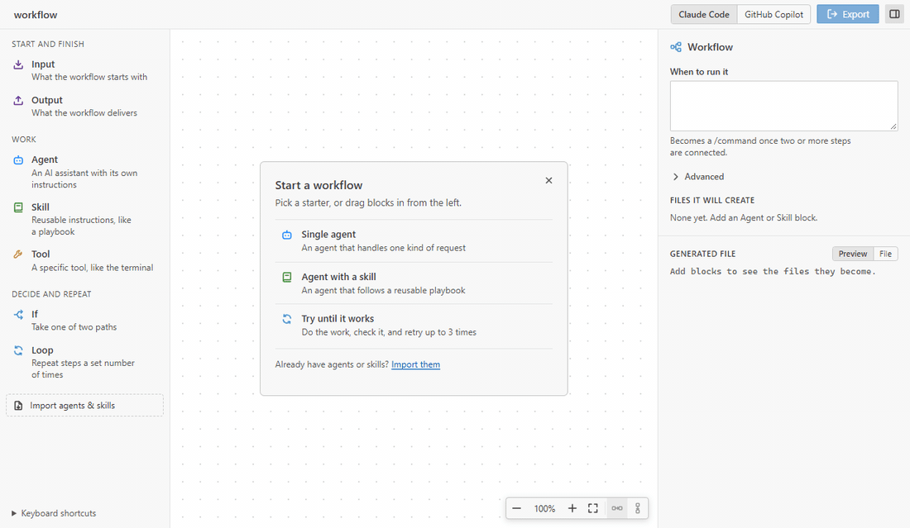
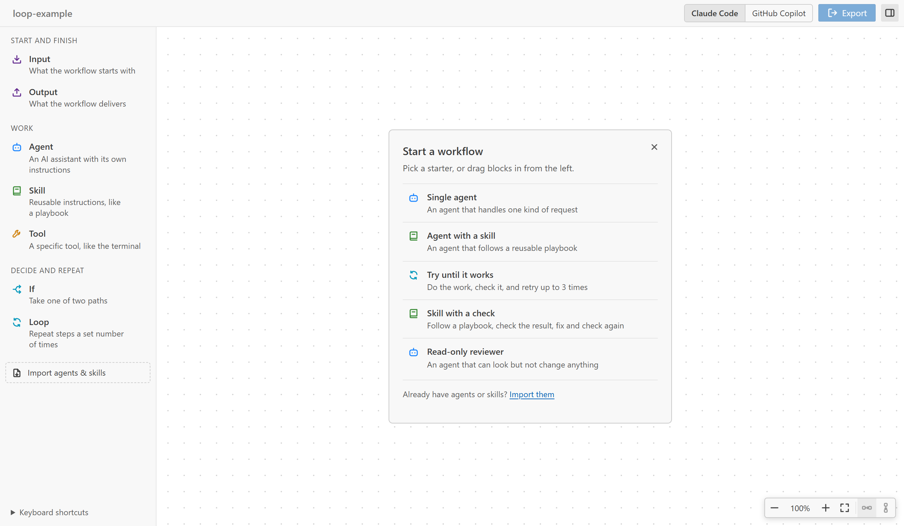
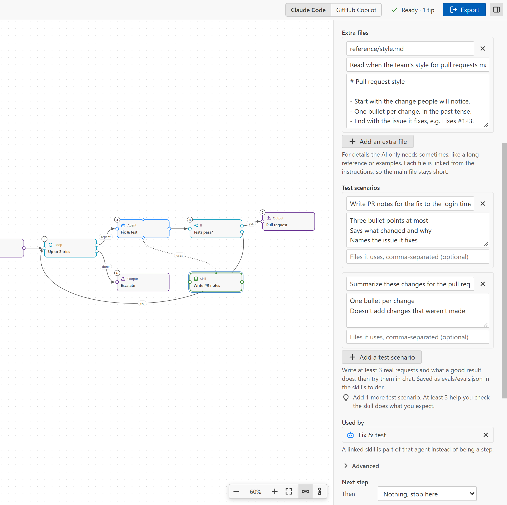
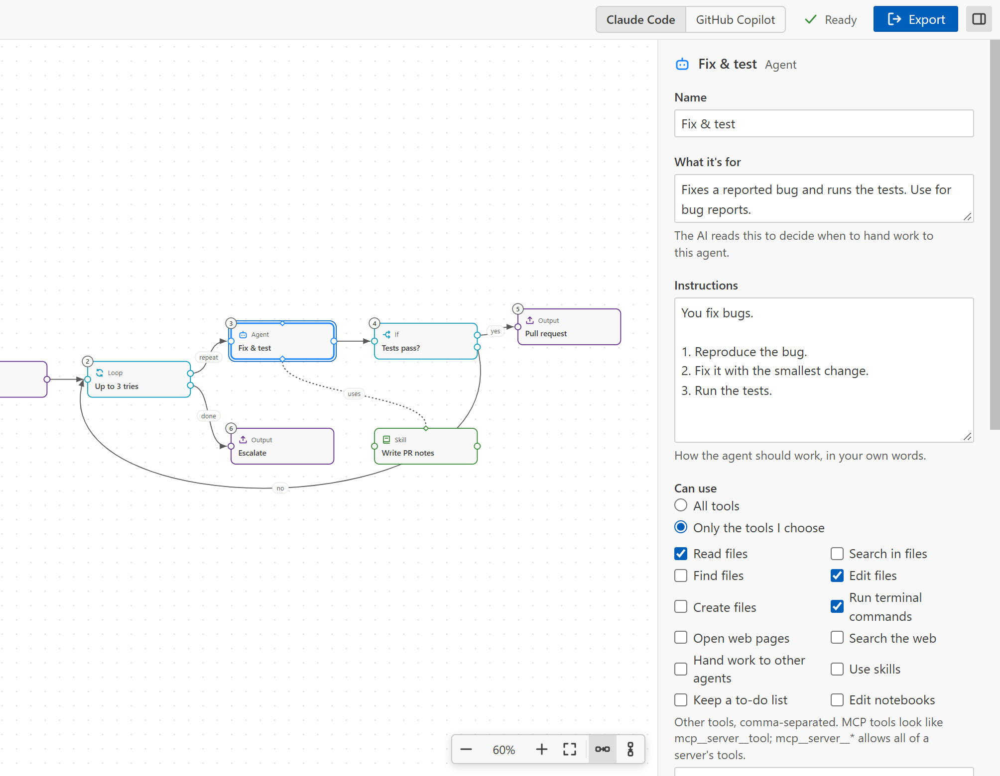
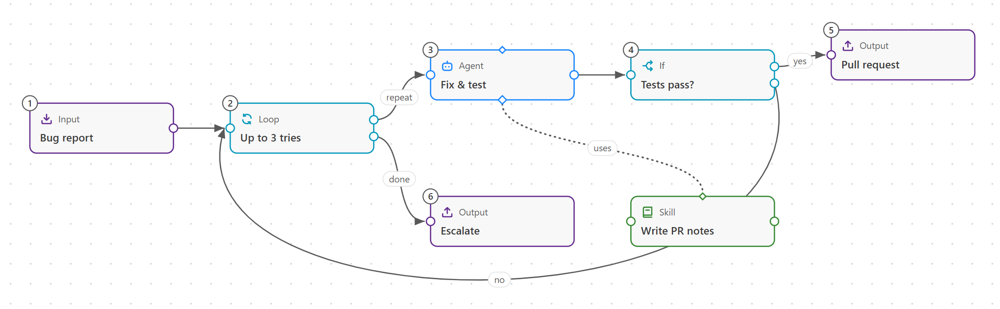
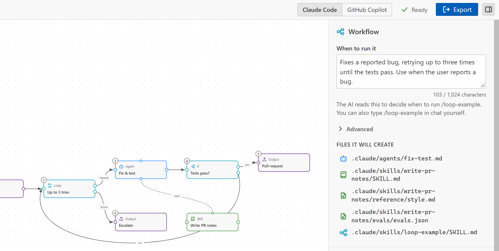
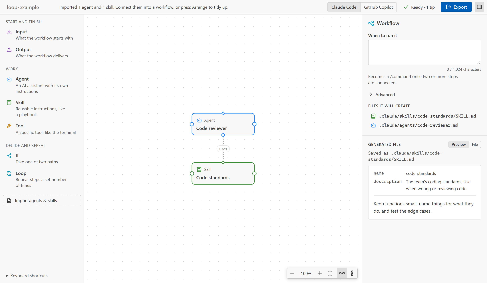

# Skill Canvas

**Sketch how the work should flow. Skill Canvas writes the agent and skill files that Claude Code and GitHub Copilot run.**

Draw the workflow with blocks and arrows, answer a few plain questions for each step, and export. No YAML, no folder rules to learn.

[Try it in your browser](https://alaturqua.github.io/skill-canvas/#try) · [Website](https://alaturqua.github.io/skill-canvas/) · [Report an issue](https://github.com/alaturqua/skill-canvas/issues)

## Why Skill Canvas

- **See the whole workflow.** Steps, decisions and retries sit on one board, numbered in the order they run.
- **Real files, not a new format.** You get standard agent and skill files in the places Claude Code and GitHub Copilot look for them. They keep working without Skill Canvas installed.
- **One sketch, two tools.** Switch between Claude Code and GitHub Copilot at any time. The same board prints both.
- **Bring what you have.** Import the agents and skills you already wrote, edit them on the board, and export them back to the same files. Settings the board doesn't show are kept as they are.
- **Good skills by default.** Every block is checked against Anthropic's [skill authoring best practices](https://platform.claude.com/docs/en/agents-and-tools/agent-skills/best-practices), with plain tips on how to make it better.

## Quick start

### 1. Create a canvas

Open a folder in VS Code. Then click **New Canvas** in the **Skill Canvas** view in the activity bar, or run **Skill Canvas: New Canvas** from the Command Palette (`Ctrl+Shift+P`, or `Cmd+Shift+P` on a Mac). Give it a name and it opens as `<name>.skillcanvas` in the folder.

Pick a starter to begin with a small working flow, or close the card and drag blocks in from the left.

**Skill with a check** follows a playbook, checks the result, then fixes it and checks again. **Read-only reviewer** is an agent that can look but not change anything.

### 2. Sketch with blocks

| Block      | Use it for                                                         |
| ---------- | ------------------------------------------------------------------ |
| **Input**  | What the workflow starts with, like a bug report or a question     |
| **Output** | What the workflow delivers, like a pull request or an answer       |
| **Agent**  | An AI assistant with its own instructions                          |
| **Skill**  | Reusable instructions, like a playbook or a checklist              |
| **Tool**   | A specific tool, like the terminal                                 |
| **If**     | Take one of two paths, like "tests pass" or "tests fail"           |
| **Loop**   | Repeat steps a set number of times, like "up to 3 tries"           |

### 3. Fill in each block

Select a block and the details panel on the right asks plain questions: what it's for, its instructions, and which tools it may use. Further down, the panel previews the exact file the block becomes. For an agent or a skill, switch to **Edit file** to change the Markdown yourself; your edits go back into the form. Drag the panel's left edge to make it wider or narrower.

A skill can also have:

- **Extra files**: details the AI only reads when it needs them, like a long reference or examples. They're saved next to the skill and linked from it, so the main instructions stay short.
- **Test scenarios**: real requests and what a good result does. Write at least three, then try them in chat. They're saved as `evals/evals.json` in the skill's folder.

**Advanced** holds the Claude Code settings:

- For a skill: who can start it, whether it runs on its own as a separate agent, its model and effort, and which files it's for.
- For an agent: its effort, a turn limit, permissions, tools it may never use, memory, and whether it works in a separate copy of the repository.

The toolbar counts anything still to fix, like an agent without instructions or a name Claude won't accept. When nothing is left to fix it says **Ready**, with the number of tips that could make it better. See [Best-practice checks](#best-practice-checks).

### 4. Connect the steps

- **Order:** drag from the dot on a block's outgoing edge to the next block. You can also pick the **Next step** in the details panel.
- **Decisions and retries:** an **If** block has a *yes* and a *no* path. A **Loop** has *repeat* and *done*.
- **Skills and tools:** drag from the small handle under an agent to a Skill or Tool block. The dotted **uses** link gives that agent the skill.
- **Helper agents:** drag from that handle to another Agent block, or use **Agents it can hand work to** in the details panel. The first agent becomes a lead that can pass parts of the work to its helpers. See [Workflows, leads and helpers](#workflows-leads-and-helpers).
- **Tidy up:** the **Arrange** buttons at the bottom right lay the board out left to right or top to bottom. The step numbers follow along.

### 5. Export

Choose **Claude Code** or **GitHub Copilot** in the toolbar and click **Export**. Skill Canvas asks where to save:

- **This project**: in the workspace, so you can commit the files and share them with your team.
- **All my projects**: in your user folder, so they're available everywhere.

Before anything is written, you see every file and whether it's new or an update. Files this canvas wrote last time are updated in place. A file that exists but wasn't written by this canvas starts unchecked. If you check it, the original goes to the trash before it's replaced.

### 6. Run it

Type the workflow's command in Claude Code or GitHub Copilot Chat, for example `/loop-example`. The command is shown at the top of the canvas; click it to copy it. The workflow hands each step to the agents you drew.

## Import the agents and skills you already have

Click **Import agents & skills** at the bottom of the block list, or run **Skill Canvas: Import Agents & Skills**. Pick from `.claude` or `.github` in your project, or from your user folder (`~/.claude`, `~/.copilot`). Skills an agent already loads arrive linked to it. Edit them on the board, export, and the same files update in place.

Nothing is lost on the way back:

- Settings the board doesn't show, like `hooks` or `mcpServers`, are written back exactly as they were.
- Markdown files in a skill's folder become its extra files, and `evals/evals.json` becomes its test scenarios.
- Other files, like scripts, are listed and left alone.

## Best-practice checks

Skill Canvas checks every agent and skill against Anthropic's [skill authoring best practices](https://platform.claude.com/docs/en/agents-and-tools/agent-skills/best-practices) and the Claude Code reference.

- **To fix:** things Claude would reject or cut off.
  - A name that isn't lowercase letters, numbers and hyphens, or that contains "claude" or "anthropic".
  - A missing description, or one over 1,024 characters.
  - XML tags.
  - A model, effort or other setting Claude Code doesn't accept.
- **Tips:** the guide's advice. Tips never block an export.
  - Say *when* to use it ("Use when the user asks for release notes").
  - Describe it in the third person ("Writes release notes…", not "I can…").
  - Be specific, and avoid generic names like `helper` or `utils`.
  - Keep the instructions under 500 lines, moving details into extra files.
  - Use forward slashes in paths, and avoid dates that will go out of date.
  - Only link to files that exist.
  - Start extra files over 100 lines with a contents list, and link them from the main instructions rather than from each other.
  - Write at least three test scenarios.

The same checks run when you open a `SKILL.md` or agent file as text, including files you didn't make with the canvas. Things to fix show as warnings and tips as information in the Problems view. To turn this off, set `skillCanvas.lint.enabled` to `false`.

## Workflows, leads and helpers

There are two ways to have several agents work together.

- **A workflow (the usual way).** Connect two or more steps and Skill Canvas writes a workflow skill, which you run as a `/command`. The main chat follows the numbered steps and hands each one to the right agent. It checks results at **If** blocks and retries in **Loop** blocks. This is the orchestration pattern Claude Code recommends, and you can see every step on the board.
- **A lead with helpers.** Link one agent to others. The lead gets the Agent tool and the names of its helpers, and decides itself when to pass work on. Helpers aren't steps of the workflow. Claude Code allows agents to start agents up to three levels deep.

A list after `Agent`, as in `tools: Agent(worker, researcher)`, only limits which agents can be started when the agent runs as the main session (`claude --agent lead`). In a normal agent, the list is ignored.

## Where the files go

Standard locations, so the tools find them without Skill Canvas installed.

| For                          | Agents                               | Skills and workflows                 |
| ---------------------------- | ------------------------------------ | ------------------------------------ |
| Claude Code, this project    | `.claude/agents/<name>.md`           | `.claude/skills/<name>/SKILL.md`     |
| Claude Code, all projects    | `~/.claude/agents/<name>.md`         | `~/.claude/skills/<name>/SKILL.md`   |
| GitHub Copilot, this project | `.github/agents/<name>.agent.md`     | `.github/skills/<name>/SKILL.md`     |
| GitHub Copilot, all projects | `~/.copilot/agents/<name>.agent.md`  | `~/.copilot/skills/<name>/SKILL.md`  |

A skill's extra files and test scenarios go in its folder, next to `SKILL.md`, for example `reference/forms.md` and `evals/evals.json`.

## Keyboard shortcuts

| Key               | Does                                                   |
| ----------------- | ------------------------------------------------------ |
| `Delete`          | Remove the selected block or connection                |
| `F2`              | Rename the selected block                              |
| Arrow keys        | Move the selected block (`Shift` for bigger steps)     |
| `+` and `-`       | Zoom in and out                                        |
| `0`               | Fit everything on screen                               |
| `Space` + drag    | Move around the canvas                                 |
| `Escape`          | Clear the selection, or close the starters             |
| `←` and `→`       | On the details panel's edge: make it wider or narrower |

## Good to know

- **Your canvas is a file.** A `.skillcanvas` file is plain JSON. Commit it next to the files it makes, so your team can open and change the workflow too.
- **Nothing leaves your machine.** Skill Canvas only reads and writes files in your workspace and user folder.
- **It follows your theme**, including high contrast themes.
- **Requirements:** VS Code 1.90 or later. To run what you export, you need Claude Code or GitHub Copilot.

## Contributing

Bug reports and ideas are welcome in [GitHub issues](https://github.com/alaturqua/skill-canvas/issues). To build and test the extension yourself, see [CONTRIBUTING.md](CONTRIBUTING.md).

## License

[Apache License 2.0](LICENSE). Skill Canvas is not affiliated with Anthropic or GitHub.
