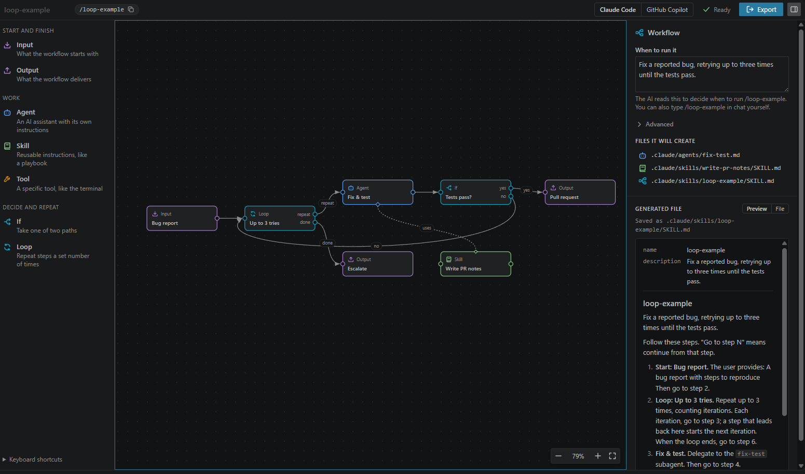

# Skill Canvas

Skill Canvas is a VS Code extension for building agent and skill workflows visually, then exporting them as real Claude Code and GitHub Copilot files.

[Try it in your browser](https://alaturqua.github.io/skill-canvas/#try) or install it from the [Visual Studio Marketplace](https://marketplace.visualstudio.com/items?itemName=alaturqua.skill-canvas).

## What it does

Skill Canvas lets you:

- create a `*.skillcanvas` workflow file in VS Code
- drag blocks such as Input, Output, Agent, Skill, Tool, If, and Loop onto a canvas
- connect the blocks to model step order and agent/tool relationships
- fill in details in a side panel without writing Markdown or YAML by hand
- export the result to native agent and skill files for Claude Code or GitHub Copilot
- import the agents and skills you already have, edit them on the canvas, and export them back

The project is designed to keep the editing experience inside VS Code while producing standard files that work outside the extension.

## Features

- Visual graph editor for workflow design, with step numbers on the blocks
- Arrange the workflow left to right or top to bottom in one click
- Import existing agents and skills from `.claude`, `.github`, `~/.claude` and `~/.copilot`
- Canvas interactions for pan, zoom, selection, and keyboard navigation
- Block types for workflow composition and control flow
- Plain-language forms for workflow details
- Export flow that writes to either a project folder or the user's home folder
- Generated workflow commands for running the exported skill

## Supported export targets

The extension currently supports exporting to:

| Target         | Agent files                      | Skill files                      | Workflow skill                       |
| -------------- | -------------------------------- | -------------------------------- | ------------------------------------ |
| Claude Code    | `.claude/agents/<name>.md`       | `.claude/skills/<name>/SKILL.md` | `.claude/skills/<workflow>/SKILL.md` |
| GitHub Copilot | `.github/agents/<name>.agent.md` | `.github/skills/<name>/SKILL.md` | `.github/skills/<workflow>/SKILL.md` |

For project-scoped exports, files are written under the current workspace. For user-scoped exports, they go under the user's home folder.

## Getting started

1. Install dependencies:

```sh
npm install
```

2. Compile the extension:

```sh
npm run compile
```

3. Open the extension in a development VS Code instance:

- Run the task: `Tasks: Run Task -> Dev: launch host (no debugger)`
- or press `F5` to run the extension with the debugger attached

This opens the sandbox workflow in `sandbox/loop-example.skillcanvas`.

## Usage

- Open the Command Palette and run `Skill Canvas: New Canvas`
- Select a workspace folder before creating a new canvas
- Add and connect blocks on the canvas
- Use the details panel to configure the selected block
- Import existing agents and skills with **Import agents & skills** in the palette, the title bar, or `Skill Canvas: Import Agents & Skills`
- Tidy up with the **Arrange** buttons in the canvas toolbar (left to right, or top to bottom)
- Export from the title bar or the command palette

## Screenshot



## Development

Useful commands:

```sh
npm install
npm run compile
npm run watch
npm test
npm run lint
```

### Notes for working on the extension

- Webview changes live under `media/`
- Extension logic lives under `src/`
- The canvas JSON model is stored in the `*.skillcanvas` file itself

## Project layout

- `src/extension.ts` — activation, commands, and export flow
- `src/canvasEditor.ts` — custom editor provider and webview integration
- `src/export.ts` — export generation and warnings
- `src/model.ts` — data model for canvas state
- `media/canvas.js` and `media/canvas.css` — editor UI
- `sandbox/` — example workflow files for development
- `PRODUCT.md` — product goals and positioning

## Repository

- GitHub: <https://github.com/alaturqua/skill-canvas>
- Publisher: `alaturqua`
- Extension ID: `alaturqua.skill-canvas`

## License

Apache License 2.0
